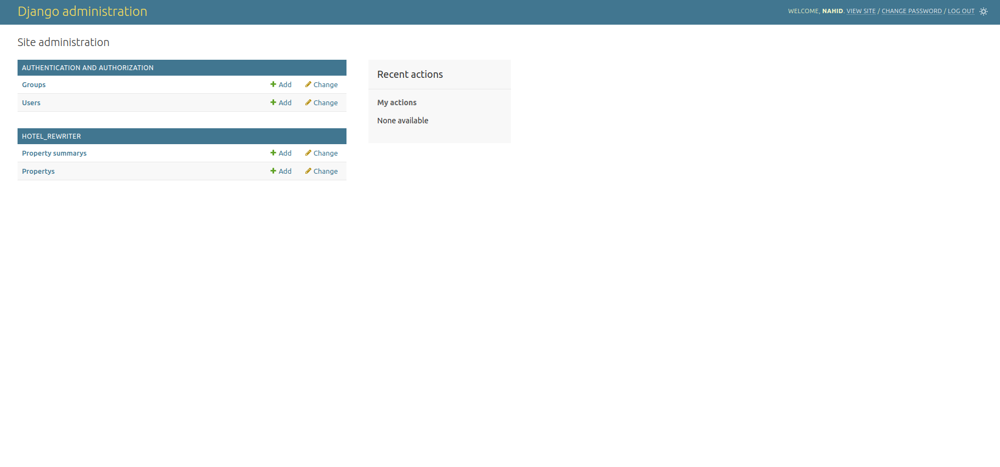
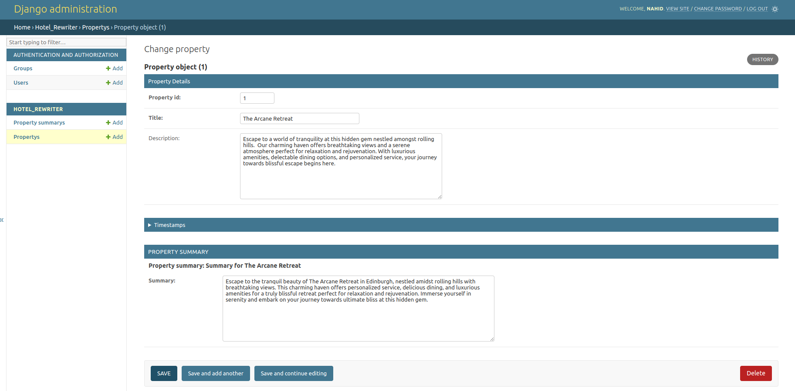
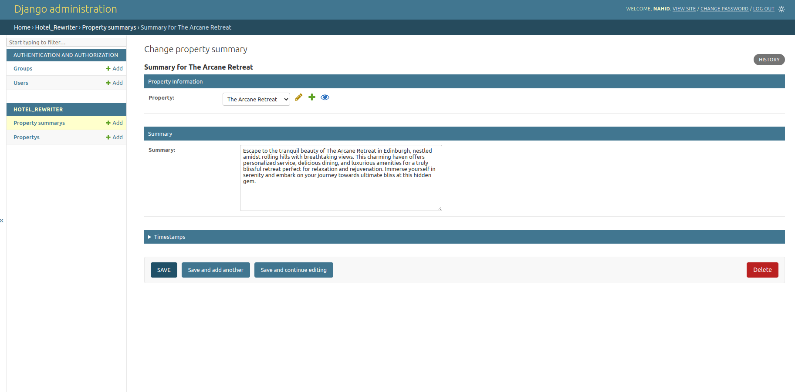

# Hotel Property AI Rewriter

> This Django project uses Ollama to rewrite hotel property titles and descriptions, and generate summaries for each property.

[](https://github.com/Speak2/llm_project/graphs/commit-activity)
[](https://github.com/Speak2/llm_project/issues)




## Table of Contents

1. [Key Features](#key-features)
2. [Prerequisites](#prerequisites)
3. [Installation](#installation)
4. [Configuration](#configuration)
5. [Usage](#usage)
6. [Database Creation guide ](#database-creation-guide )
7. [Admin Panel](#admin-panel)
8. [Project Structure](#project-structure)
9. [Technologies Used](#technologies-used)
10. [Troubleshooting](#troubleshooting)
11. [Development Tools](#development-tools)
12. [Author](#authors)
13. [License](#license)

## Key Features

- Automated rewriting of property titles and descriptions using AI
- Generation of property summaries
- Integration with Ollama for natural language processing
- PostgreSQL database for efficient data storage and retrieval
- Django management command for easy execution of the rewriting process

## Prerequisites
Tools and packages required to successfully install this project:
- Python 3.8+
- Django 3.2+
- PostgreSQL
- Ollama

## Installation

1. Before proceeding with the installation of this project, please ensure that you have both set up and run the `Django_assignment` project before.

   GitHub repository: https://github.com/Speak2/Django_assignment

1. Clone the repository:
   ```
   git clone https://github.com/Speak2/llm_project
   cd llm_project
   ```

2. Create a virtual environment and activate it:
   ```
   python -m venv venv
   source venv/bin/activate  # On Windows use `venv\Scripts\activate`
   ```

3. Install the required packages:
   ```
   pip install -r requirements.txt
   ```

5. Configure the project (see Configuration section below)

6. Run migrations:
   ```
   python manage.py migrate
   ```
   If any issues arise during migration, please refer to the troubleshooting section.

7. Install and start Ollama:
   Follow the instructions at [Ollama's official website](https://ollama.ai/download) to install Ollama on your system.

8. Pull the required model (e.g., gemma2:2b):
   ```
   ollama pull gemma2:2b
   ```


## Configuration

1. **Create a New `config.py` File**:

   Please create a new file named `config.py` in the `llm_project/config.py` directory. Include the following code in this file, ensuring that you replace the placeholders with your specific database configuration details:
   ```python
   DJANGO_DATABASE_CONFIG = {
    'ENGINE': 'django.db.backends.postgresql',
    'NAME': 'django_database_name', # this should be django database name previously used for the django project
    'USER': 'username',
    'PASSWORD': 'password',
    'HOST': 'localhost',
    'PORT': 'port_address',
   }
   ```

   Make sure to adjust these settings according to your PostgreSQL configuration.

2. For reference follow the `config-sample.txt` file in the root directory.
 
## Usage

1. Ensure Ollama is running:
   ```
   ollama run gemma2:2b
   ```

2. Run the property rewriter command:
   ```
   python manage.py rewrite_properties
   ```
   This command will:
   - Rewrite the title and description of each property in the database
   - Generate a summary for each property
   - Save the updated information and new summaries to the database
3. Create a superuser(Admin user):
   ```bash
   python manage.py createsuperuser
   ```

4. Start the development server:
   ```bash
   python manage.py runserver
   ```

5. Access the application at `http://127.0.0.1:8000/`
6. Access the admin panel at `http://127.0.0.1:8000/admin`


## Database Creation guide 

This project leverages the database established by the prior Django project. Additionally, a new `propertysummary` table has been created.
In order to manually create the database table use the following sql query to create the database table in the existing django database.

The sql to create the the `propertysummary` table-
```sql
CREATE TABLE propertysummary (
   id SERIAL PRIMARY KEY,
   property_id INTEGER NOT NULL UNIQUE,
   summary TEXT NOT NULL,
   created_at TIMESTAMP WITH TIME ZONE NOT NULL DEFAULT NOW(),
   updated_at TIMESTAMP WITH TIME ZONE NOT NULL DEFAULT NOW(),
   CONSTRAINT fk_property
      FOREIGN KEY(property_id) 
      REFERENCES property(id) 
      ON DELETE CASCADE
);
```

Here is the database schema for the `PropertySummary` table based on the Django model provided:

| Column Name  | Data Type          | Constraints                                               |
|--------------|--------------------|-----------------------------------------------------------|
| id           | SERIAL (or INTEGER) | PRIMARY KEY                                               |
| property_id  | INTEGER            | FOREIGN KEY references `property(id)` with `CASCADE` on delete |
| summary      | TEXT               | NOT NULL                                                  |
| created_at   | TIMESTAMP          | NOT NULL, defaults to the current timestamp               |
| updated_at   | TIMESTAMP          | NOT NULL, auto-updated to the current timestamp           |

- The `property_id` column is a foreign key that references the `id` column of the `property` table.
- The `created_at` and `updated_at` columns automatically record the timestamps of when a record is created and last updated, respectively.
- The `property_id` field has a `OneToOne` relationship with the `Property` table, meaning each property can have only one associated summary.
## Admin Panel

Access the admin panel at `http://127.0.0.1:8000/admin/` using the superuser credentials.

## Project Structure

- `hotel_rewriter/`: Main Django app
  - `models.py`: Contains the database models (Property, PropertySummary, etc.)
  - `management/commands/rewrite_properties.py`: Contains the Django management command for rewriting properties
- `config.py`: Contains database configuration
- `requirements.txt`: List of Python dependencies

   ```bash
   llm_project/
   │
   ├── hotel_rewriter/   
   │   ├── management
   │   │  └── commands    
   │   │      └── rewrite_properties.py
   │   ├── migrations/
   │   ├── __init__.py                   
   │   ├── admin.py 
   │   ├── apps.py
   │   ├── models.py
   │   └── views.py
   ├── llm_project/   
   │   ├── __init__.py       
   │   ├── settings.py 
   │   ├── urls.py
   │   └── wsgi.py 
   ├── readme_img/ 
   ├── manage.py
   ├── config.py     # config.py file should be created here
   ├── config-sample.txt           
   ├── README.md   
   ├── requirements.txt      
   └── LICIENSE            
   ```
## Screenshots
This section contains the title and description of each hotel, followed by a summary of each hotel.





## Technologies Used

- Python 3.8+
- Django 3.2+
- PostgreSQL 12+
- Ollama (for AI-powered text generation)
- psycopg2 (PostgreSQL adapter for Python)

## Troubleshooting

If you encounter connection issues with Ollama, ensure that:
1. Ollama is running on your system
2. The Ollama service is accessible at `http://localhost:11434` (default)
3. The model specified in the command (e.g., "gemma2:2b") is available in your Ollama setup

For database connection issues:
1. Verify that PostgreSQL is running on correct port
2. Check that the database credentials in `config.py` are correct
3. Ensure that the database user has the necessary permissions on the specific database.

For resolving migration issues:
1. If the migration does not generate the new summary table, consider starting fresh with the Django project.
2. After successfully running the Django project on a new database, proceed to run the LLM project.
3. This issue may arise due to migration history stored in the migration table, which could conflict with previous migration records.

## Development Tools

- Linter: flake8 (install from VS Code extension store)
- Code formatter: autopep8 (install from VS Code extension store)

linter and code formatter has been used to maintain code quality

## Authors

This project is for Django admin panel practice created by me for assignment purposes during my internship days at w3 egnineers ltd. 
 
Nahid Mahamud  – nahid.nm91@gmail.com
 
 You can find me here at:
[Github](https://github.com/Speak2) 


## License

A short snippet describing the license (MIT, Apache etc).

This project is licensed under the MIT License - see the LICENSE.md file for details

MIT © Nahid Mahamud
